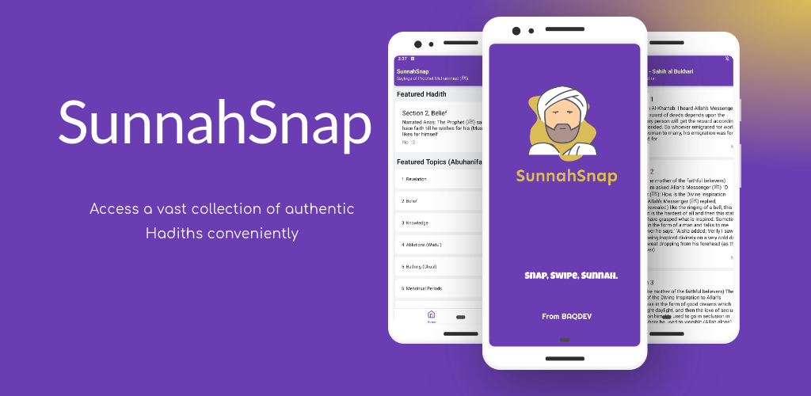
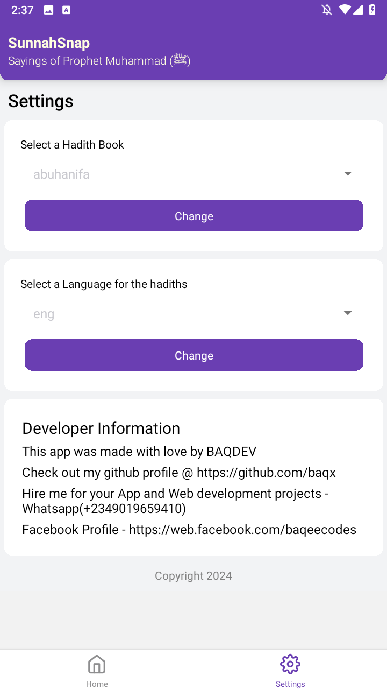
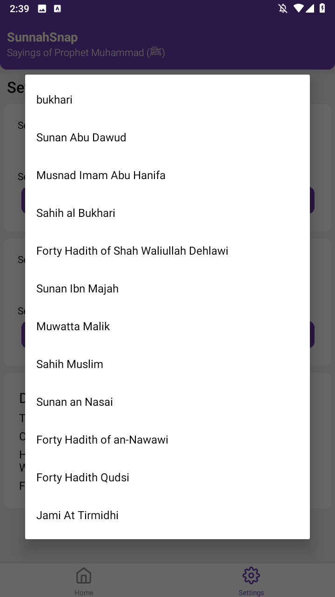

<h1 align="center">SunnahSnap</h1>

  

  

## Introduction

A platform where users can access Sunnah teachings or practices swiftly and conveniently, perhaps through short, easily digestible content or snippets.

## Requirements

- NPM (Node Package Manager)
- React-Native

## Install all packages

> npm install

## Screenshots

  

    
      &nbsp;&nbsp;&nbsp;
      
    

  

  

    
       
    
  

  

    
       
    
  

  

    
      &nbsp;&nbsp;&nbsp;
      
    
  

    
       
    
  

## Contributors

<table border="0">
  <tr>
    <td align="center">
      <a href="https://github.com/fawazahmed0">
         
          <b>Fawaz Ahmed</b>
      </a>
    </td>
    
  </tr>
</table>
